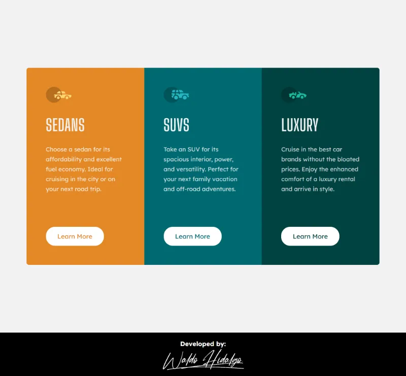
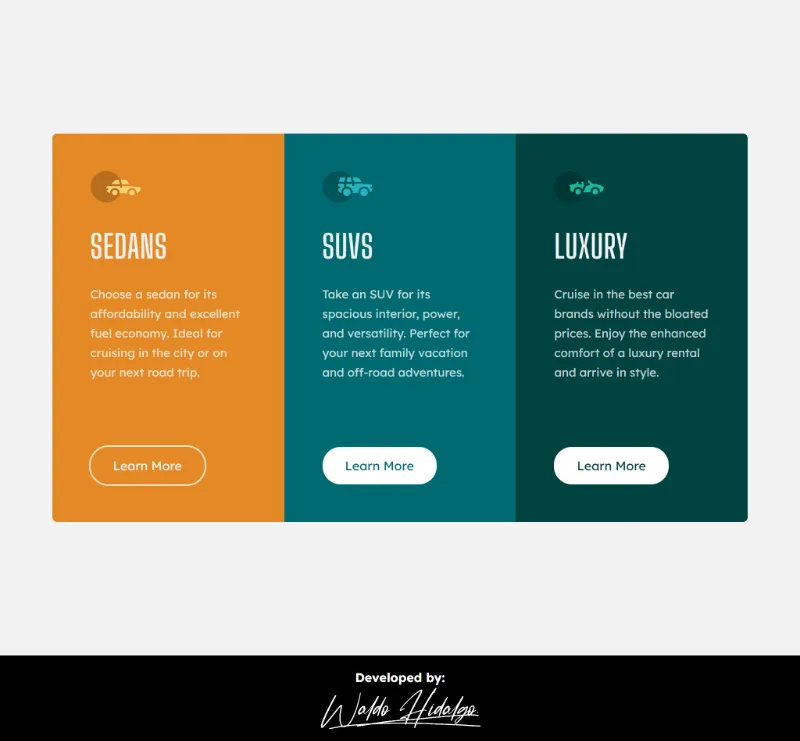

# 3-column preview card component solution

Repositorio con el código solución del proyecto: [3-column preview card component challenge on Frontend Mentor](https://www.frontendmentor.io/challenges/3column-preview-card-component-pH92eAR2-).

Primer proyecto utilizando Vue junto con TailwindCSS.

## Tabla de Contenido

- [3-column preview card component solution](#3-column-preview-card-component-solution)
  - [Tabla de Contenido](#tabla-de-contenido)
  - [Challenge](#challenge)
  - [Diseño a Replicar](#diseño-a-replicar)
    - [1-Mobile Design](#1-mobile-design)
    - [2-Desktop Design](#2-desktop-design)
    - [3-Active States Design](#3-active-states-design)
  - [Mi proyecto](#mi-proyecto)
    - [1-Mobile Size](#1-mobile-size)
    - [2-Desktop Size](#2-desktop-size)
    - [3-Tablet Size](#3-tablet-size)
    - [4-Active States](#4-active-states)

## Challenge

El desafío consiste en:

> Your challenge is to build out this 3-column preview card component and get it looking as close to the design as possible.
> You can use any tools you like to help you complete the challenge. So if you've got something you'd like to practice, feel free to give it a go.
> Your users should be able to:
>
> - View the optimal layout depending on their device's screen size
> - See hover states for interactive elements

## Diseño a Replicar

### 1-Mobile Design

### 2-Desktop Design

### 3-Active States Design

## Mi proyecto

### 1-Mobile Size

### 2-Desktop Size

### 3-Tablet Size

### 4-Active States

